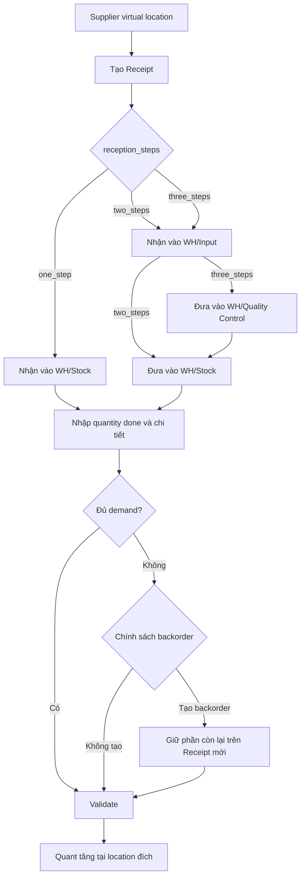
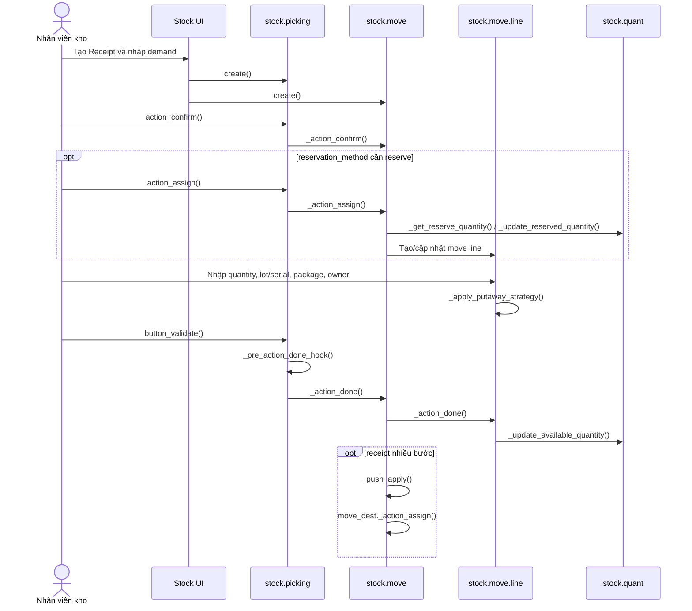

# WF-01 — Nhập kho (Receipt)

## 1. Mục đích nghiệp vụ

Đưa hàng từ location ảo `Supplier` vào location `Internal` của warehouse. Đợt này mô tả phần stock operation; chứng từ nguồn của nghiệp vụ mua hàng sẽ được bổ sung sau.

## 2. Đường đi của hàng

| Cấu hình | Đường đi | Operation type | Model phiếu |
|---|---|---|---|
| Nhập 1 bước | `Supplier -> WH/Stock` | `incoming` / `WH Receipts` | `stock.picking` |
| Nhập 2 bước | `Supplier -> WH/Input -> WH/Stock` | `incoming` rồi `internal` | 2 `stock.picking` |
| Nhập 3 bước | `Supplier -> WH/Input -> WH/Quality Control -> WH/Stock` | `incoming` rồi 2 `internal` | 3 `stock.picking` |

`reception_steps` trên `stock.warehouse` quyết định số bước. Warehouse tạo/cập nhật location, picking type và push rule cho các bước trung gian.

### 2.1. Sơ đồ hoạt động nghiệp vụ

### 2.2. Master data sử dụng

| Master data | Vai trò trong Receipt | Mapping |
|---|---|---|
| Warehouse | Quyết định `reception_steps`, location và operation type được sinh | `stock.warehouse` |
| Location | Supplier → Input/QC → Internal Stock | `stock.location` |
| Operation Type | `incoming` cho bước nhận; `internal` cho bước chuyển nội bộ | `stock.picking.type` |
| Product/UoM | Hàng nhận và cách quy đổi số lượng | `product.product`, `uom.uom` |
| Lot/Serial | Truy xuất hàng nhận nếu product có tracking | `stock.lot`, `stock.move.line` |
| Package/Owner | Container và chủ sở hữu của hàng nhận | `stock.package`, `res.partner` |
| Putaway | Chọn location con sau khi hàng vào Input/Stock | `stock.putaway.rule` |

Chi tiết master data dùng chung: [01_master_data.md](01_master_data.md).

## 3. Điều kiện đầu vào

- Warehouse đang active và có `lot_stock_id` là location internal.
- Có `stock.picking.type` với `code = 'incoming'`; source mặc định là Supplier và destination là location đầu vào của cấu hình.
- Sản phẩm là hàng tồn kho; UoM, tracking (`none`, `lot`, `serial`) và company hợp lệ.
- Nếu dùng lot/serial, operation type cho phép tạo hoặc chọn lot qua `use_create_lots`/`use_existing_lots`.
- Nếu dùng package/putaway, package type, package và putaway rule phải phù hợp.

## 4. Flow nghiệp vụ đầu-cuối

| Bước | Nghiệp vụ | Đối tượng/kết quả | Mapping code 1:1 |
|---|---|---|---|
| R1 | Người dùng mở Receipts và chọn operation type | Chọn `stock.picking.type` có `code='incoming'` | `stock.action_picking_tree_incoming`; `stock.view_picking_form`; `stock.picking.type.code` |
| R2 | Tạo phiếu nhập, khai báo sản phẩm, số lượng, source/destination | Tạo `stock.picking` và các `stock.move` ở trạng thái `draft` | `stock.picking.create()`; `stock.move.create()`; field `picking_type_id`, `location_id`, `location_dest_id`, `product_id`, `product_uom_qty` |
| R3 | Xác nhận phiếu | Move chuyển `draft -> confirmed` hoặc `waiting`; nếu cấu hình reservation at confirmation thì bắt đầu cấp phát | `stock.picking.action_confirm()` -> `stock.move._action_confirm()`; field `state`, `reservation_date` |
| R4 | Kiểm tra khả dụng (nếu cần) | Receipt được gán move line để ghi nhận số lượng/lot/package nhận | `stock.picking.action_assign()` -> `stock.move._action_assign()`; tạo/cập nhật `stock.move.line` |
| R5 | Nhân viên nhập số lượng thực nhận | `stock.move.line.quantity`, `lot_id`/`lot_name`, `package_id`, `result_package_id`, `owner_id` được cập nhật | `stock.view_stock_move_line_detailed_operation_tree`; `stock.view_move_line_form`; `stock.move.line` fields |
| R6 | Xác định location cất hàng | Với putaway, destination được chuyển tới location con phù hợp; nếu không có rule, giữ destination của move | `stock.move.line._apply_putaway_strategy()` -> `stock.location._get_putaway_strategy()` |
| R7 | Validate phiếu | Kiểm tra quantity, lot/serial, company và backorder; xác định phần được hoàn tất | `stock.picking.button_validate()` -> `_sanity_check()` -> `_pre_action_done_hook()` -> `_check_backorder()` |
| R8 | Ghi nhận dịch chuyển | Move line chuyển hàng khỏi Supplier/Input/QC và tăng tồn ở destination; reservation được giải phóng | `stock.picking._action_done()` -> `stock.move._action_done()` -> `stock.move.line._action_done()` |
| R9 | Kết thúc bước | Picking/move ở `done`; quant được cập nhật theo product/location/lot/package/owner/company | `stock.quant._update_available_quantity()`; `stock.picking.date_done`; `stock.move.state='done'` |
| R10 | Nếu là receipt nhiều bước | Bước kế tiếp được tạo/đã tồn tại bởi rule; sau khi bước trước done, bước sau được assign | `stock.warehouse.get_rules_dict()`; `stock.rule`; `stock.move._push_apply()`; `stock.move._action_assign()` |

### 4.1. Sơ đồ runtime/code

### 4.2. Nhánh reservation

- `reservation_method = 'at_confirm'`: xác nhận move sẽ đặt reservation theo logic của `_action_confirm()`.
- `reservation_method = 'manual'`: người dùng phải bấm Check Availability (`action_assign()`).
- `reservation_method = 'by_date'`: assignment phụ thuộc ngày reservation; không mở rộng sang scheduler/procurement.
- Receipt từ location Supplier thường bypass reservation theo usage của location; move line vẫn được tạo để ghi nhận thực nhận.

### 4.3. Nhánh tracking

- `tracking='none'`: chỉ cần quantity.
- `tracking='lot'`: khi quantity done > 0, validation yêu cầu lot nếu operation type đang yêu cầu lot.
- `tracking='serial'`: số lượng được kiểm tra theo từng serial; duplicate hoặc quantity không hợp lệ bị chặn.
- Lot/serial mới có thể được tạo từ `lot_name` khi `use_create_lots=True`; lot có sẵn được chọn qua `lot_id` khi `use_existing_lots=True`.

### 4.4. Nhánh package/putaway

- `result_package_id` đại diện package đích sau khi nhập.
- Putaway rule có thể chọn location con theo product, category, package type và capacity.
- Nếu package chứa nhiều product mà rule không thể giữ một location chung, Odoo giữ destination move hoặc báo lỗi khi package không nhất quán.

### 4.5. Nhánh thiếu số lượng

- Nếu `create_backorder='ask'`, `button_validate()` trả action wizard `stock.backorder.confirmation`.
- Nếu `always`, phần chưa nhận tạo backorder.
- Nếu `never`, phần chưa nhận bị cancel; không có backorder.

### 4.6. Nhánh sau khi receipt hoàn tất

- `Backorder`: phần chưa nhận đi qua `stock.picking._check_backorder()` và wizard `stock.backorder.confirmation`.
- `Return receipt`: từ receipt `done`, hàng đi `Internal -> Supplier/Input`; `stock.act_stock_return_picking` -> `stock.return.picking._create_return()` -> picking return xử lý như receipt mới.
- `Scrap hàng đã nhận`: hàng đi từ location internal hiện tại tới scrap/inventory loss; `stock.picking.button_scrap()` -> `stock.scrap.action_validate()` -> `do_scrap()`.

## 5. Kết quả cuối

- Nhập 1 bước: quant tăng tại `WH/Stock` hoặc location putaway thực tế.
- Nhập 2 bước: quant lần lượt đi `Supplier -> WH/Input -> WH/Stock`.
- Nhập 3 bước: quant lần lượt đi `Supplier -> WH/Input -> WH/Quality Control -> WH/Stock`.
- Mỗi bước hoàn tất có `stock.picking.state='done'`, `stock.move.state='done'`, move line giữ chi tiết thực tế.
- Traceability có thể truy ngược từ quant/lot tới move line, move và picking.

## 6. Action hỗ trợ

| Action | Mục đích | Mapping |
|---|---|---|
| Mark as Todo | Xác nhận phiếu | `stock.picking.action_confirm()` |
| Check Availability | Gán hàng/reserve | `stock.picking.action_assign()` |
| Detailed Operations | Nhập lot, package, quantity done | `stock.picking.action_detailed_operations()`; `stock.view_stock_move_line_detailed_operation_tree` |
| Put in Pack | Gom move line vào package | `stock.picking.action_put_in_pack()`; `stock.stock_put_in_pack_form` |
| Validate | Ghi nhận nhập kho | `stock.action_validate_picking`; `stock.picking.button_validate()` |
| Cancel | Hủy phiếu chưa done | `stock.picking.action_cancel()` |
| Reception Report | Xem phân bổ hàng nhập tiếp theo | `stock.picking.action_view_reception_report()` |
| Backorder | Giữ phần receipt chưa nhận | `stock.picking._check_backorder()`; `stock.backorder.confirmation.process()`; `stock.view_backorder_confirmation` |
| Return | Trả hàng đã nhận về Supplier/Input | `stock.act_stock_return_picking`; `stock.return.picking.action_create_returns()` |
| Scrap | Loại hàng đã nhận khỏi tồn | `stock.picking.button_scrap()`; `stock.scrap.action_validate()` |

## 7. Mã nguồn và test tham chiếu

| Nội dung | Source |
|---|---|
| Warehouse step/routing | `addons/stock/models/stock_warehouse.py`: `reception_steps`, `get_rules_dict()`, `_get_input_output_locations()`, `_update_reception_delivery_resupply()` |
| Picking lifecycle | `addons/stock/models/stock_picking.py`: `create()`, `action_confirm()`, `action_assign()`, `button_validate()`, `_action_done()` |
| Move lifecycle/reservation | `addons/stock/models/stock_move.py`: `_action_confirm()`, `_action_assign()`, `_update_reserved_quantity()`, `_action_done()` |
| Move line execution | `addons/stock/models/stock_move_line.py`: `_apply_putaway_strategy()`, `_action_done()` |
| Quant mutation | `addons/stock/models/stock_quant.py`: `_update_reserved_quantity()`, `_update_available_quantity()` |
| UI | `addons/stock/views/stock_picking_views.xml`: `view_picking_form`, `action_picking_tree_incoming`, `action_validate_picking` |
| Basic receipt execution | `addons/stock/tests/test_stock_flow.py::TestStockFlow.test_00_picking_create_and_transfer_quantity` |
| Two-step receipt/reservation | `addons/stock/tests/test_stock_flow.py::TestStockFlow.test_2steps_and_automatic_reservation` |
| Multi-step receipt/putaway | `addons/stock/tests/test_packing.py::TestPacking.test_pack_in_receipt_two_step_single_putway`; `test_pack_in_receipt_two_step_multi_putaway` |
| Lot/serial receipt | `addons/stock/tests/test_stock_flow.py::TestStockFlow.test_receive_tracked_product`; `addons/stock/tests/test_move2.py::TestSinglePicking.test_use_create_lot_use_existing_lot_1` |
| Package chain | `addons/stock/tests/test_stock_flow.py::TestStockFlow.test_40_pack_in_pack`; `addons/stock/tests/test_packing.py::TestPacking.test_pack_in_receipt_two_step_single_putway` |
