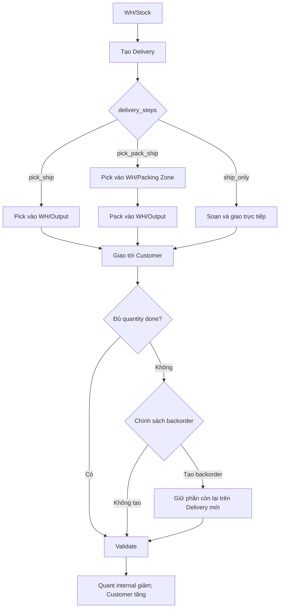
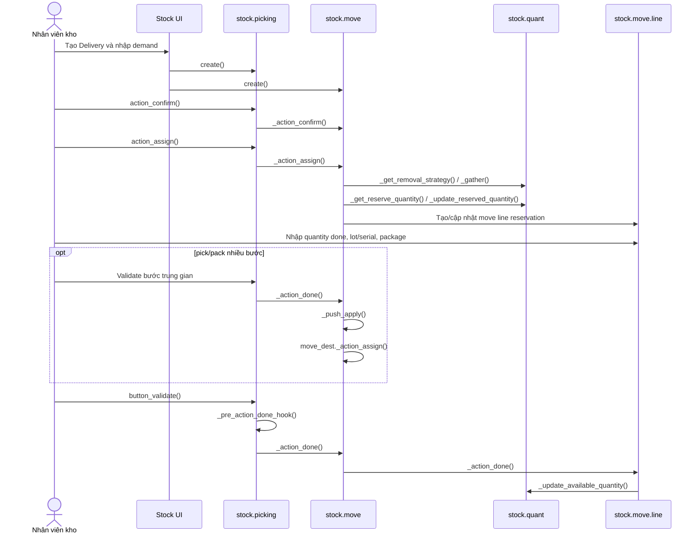

# WF-02 — Xuất kho / giao hàng (Delivery)

## 1. Mục đích nghiệp vụ

Đưa hàng từ location `Internal` của warehouse tới location ảo `Customer`. Đợt này mô tả phần stock operation; chứng từ nguồn của nghiệp vụ bán hàng sẽ được bổ sung sau.

## 2. Đường đi của hàng

| Cấu hình `delivery_steps` | Đường đi | Operation type |
|---|---|---|
| `ship_only` | `WH/Stock -> Customer` | `outgoing` |
| `pick_ship` | `WH/Stock -> WH/Output -> Customer` | `internal` rồi `outgoing` |
| `pick_pack_ship` | `WH/Stock -> WH/Packing Zone -> WH/Output -> Customer` | `internal`, `internal`, `outgoing` |

Warehouse tạo location trung gian, picking type và push/pull rule tương ứng.

### 2.1. Sơ đồ hoạt động nghiệp vụ

### 2.2. Master data sử dụng

| Master data | Vai trò trong Delivery | Mapping |
|---|---|---|
| Warehouse | Quyết định `delivery_steps`, location và operation type được sinh | `stock.warehouse` |
| Location | Internal Stock → Pick/Pack/Output → Customer | `stock.location` |
| Operation Type | `outgoing` cho giao cuối; `internal` cho Pick/Pack | `stock.picking.type` |
| Product/UoM | Hàng xuất và cách quy đổi demand/quantity | `product.product`, `uom.uom` |
| Lot/Serial | Xác định chính xác hàng được xuất | `stock.lot`, `stock.move.line` |
| Package/Owner | Container và chủ sở hữu của hàng xuất | `stock.package`, `res.partner` |
| Removal Strategy | Chọn quant ưu tiên khi reserve | `product.removal`, `stock.quant` |

Chi tiết master data dùng chung: [01_master_data.md](01_master_data.md).

## 3. Điều kiện đầu vào

- Warehouse có location internal chứa hàng và customer virtual location.
- Có `stock.picking.type` với `code='outgoing'`; source mặc định theo `delivery_steps`.
- Sản phẩm, UoM, company hợp lệ; quant khả dụng đủ hoặc cho phép giao một phần.
- Nếu xuất theo lot/serial/package/owner, thông tin này phải phù hợp với quant được reserve.

## 4. Flow nghiệp vụ đầu-cuối

| Bước | Nghiệp vụ | Đối tượng/kết quả | Mapping code 1:1 |
|---|---|---|---|
| D1 | Người dùng mở Deliveries và chọn operation type | Chọn `stock.picking.type` có `code='outgoing'` | `stock.action_picking_tree_outgoing`; `stock.view_picking_form`; `stock.picking.type.code` |
| D2 | Tạo phiếu giao, khai báo hàng cần xuất và Customer | Tạo `stock.picking` + `stock.move` ở `draft` | `stock.picking.create()`; `stock.move.create()`; `partner_id`, `location_id`, `location_dest_id`, `product_uom_qty` |
| D3 | Xác nhận phiếu | Move chuyển `draft -> confirmed` hoặc `waiting`; operation nhiều bước có thể sinh move liên kết | `stock.picking.action_confirm()` -> `stock.move._action_confirm()`; `move_orig_ids`/`move_dest_ids` |
| D4 | Kiểm tra khả dụng | Chọn quant theo location, lot, package, owner và removal strategy; tạo move line reservation | `stock.picking.action_assign()` -> `stock.move._action_assign()` -> `stock.move._update_reserved_quantity()` -> `stock.quant._get_reserve_quantity()` |
| D5 | Nhân viên thực hiện picking/packing | Ghi quantity done, lot/serial, source package, destination package; có thể đánh dấu `picked` | `stock.move.line`; `stock.view_stock_move_line_detailed_operation_tree`; `stock.picking.action_put_in_pack()` |
| D6 | Hoàn tất từng bước trung gian | Hàng đi Stock -> Output hoặc Packing -> Output; bước sau chỉ available khi bước trước done | `stock.move._action_done()` -> `stock.move._push_apply()` -> `move_dest._action_assign()` |
| D7 | Validate bước giao cuối | Kiểm tra quantity, tracking, package, picked và backorder | `stock.picking.button_validate()` -> `_sanity_check()` -> `_pre_action_done_hook()` |
| D8 | Ghi nhận xuất hàng | Move line trừ quant tại internal location và tăng quant tại Customer; reservation được giải phóng | `stock.picking._action_done()` -> `stock.move._action_done()` -> `stock.move.line._action_done()` -> `stock.quant._update_available_quantity()` |
| D9 | Kết thúc | Picking/move `done`, `date_done` được ghi; có thể in phiếu giao/label | `stock.move.state='done'`; `stock.picking.date_done`; `_get_autoprint_report_actions()` |

### 4.1. Sơ đồ runtime/code

### 4.2. Reservation và removal

- `at_confirm`: reservation được thử khi confirm; `manual`: cần Check Availability; `by_date`: theo reservation date.
- `stock.quant._gather()` chọn quant theo removal strategy của location/product/category.
- Reservation cập nhật `stock.quant.reserved_quantity` và tạo/cập nhật `stock.move.line`.
- Nếu đủ hàng: move `assigned`; nếu thiếu: `partially_available` hoặc `confirmed` tùy kết quả.
- Hàng đã reserve có thể unreserve bằng `stock.picking.do_unreserve()` trước khi đổi nguồn/lot/package.

### 4.3. Nhánh giao một phần

- Quantity done nhỏ hơn demand đi qua `_check_backorder()`.
- `create_backorder='ask'`: mở `stock.backorder.confirmation` để người dùng chọn.
- `always`: tạo picking backorder cho phần còn lại.
- `never`: cancel phần còn lại.
- Picking hiện tại vẫn `done` nếu phần đã picked hợp lệ; backorder giữ demand chưa thực hiện.

### 4.4. Nhánh tracking/package

- Lot/serial phải thuộc product và phù hợp quant đã reserve.
- Serial được xử lý theo từng đơn vị; quantity done sai rounding hoặc duplicate serial bị chặn trong `stock.move.line._action_done()`.
- Package được di chuyển theo `package_id`/`result_package_id`; Odoo kiểm tra package không bị tách thành hai location khi validate.
- Với `move_type='one'`, operation chờ đủ sản phẩm theo shipping policy; `direct` cho phép xử lý từng phần.

### 4.5. Nhánh sau khi delivery hoàn tất

- `Backorder`: phần chưa giao đi qua `_check_backorder()` và `stock.backorder.confirmation`; picking mới giữ demand còn lại.
- `Return delivery`: hàng đi `Customer/Output -> Internal`; `stock.act_stock_return_picking` -> `stock.return.picking._create_return()` -> confirm/assign/validate như một internal/incoming operation tùy return type.
- `Scrap trước khi giao`: hàng đã pick nhưng loại bỏ khỏi tồn đi tới scrap location; `stock.picking.button_scrap()` -> `stock.scrap.action_validate()` -> `stock.scrap.do_scrap()`.

## 5. Kết quả cuối

- `ship_only`: quant đi trực tiếp `WH/Stock -> Customer`.
- `pick_ship`: quant đi `WH/Stock -> WH/Output`, sau đó `WH/Output -> Customer`.
- `pick_pack_ship`: quant đi qua Packing Zone rồi Output trước khi tới Customer.
- Tồn internal giảm; Customer location tăng; move line giữ dấu vết product/lot/package/owner.
- Phiếu đã done không được sửa như phiếu draft; return được tạo bằng action riêng.

## 6. Action hỗ trợ

| Action | Mục đích | Mapping |
|---|---|---|
| Mark as Todo | Xác nhận demand giao | `stock.picking.action_confirm()` |
| Check Availability | Reserve hàng | `stock.picking.action_assign()` |
| Unreserve | Hủy reservation để thay đổi cách lấy hàng | `stock.picking.do_unreserve()` -> `stock.move._do_unreserve()` |
| Detailed Operations | Chọn lot/serial/package và quantity done | `stock.picking.action_detailed_operations()` |
| Put in Pack | Đóng hàng vào package | `stock.picking.action_put_in_pack()`; `stock.stock_put_in_pack_form` |
| Validate | Hoàn tất bước giao | `stock.action_validate_picking`; `stock.picking.button_validate()` |
| Print Delivery Slip | In chứng từ giao | `stock.action_report_delivery`; `stock.picking.do_print_picking()` |
| Return | Tạo flow ngược từ Customer | `stock.act_stock_return_picking` |
| Backorder | Giữ phần delivery chưa giao | `stock.picking._check_backorder()`; `stock.backorder.confirmation.process()`; `stock.view_backorder_confirmation` |
| Scrap | Loại hàng không thể giao khỏi tồn | `stock.picking.button_scrap()`; `stock.scrap.action_validate()` |
| Cancel | Hủy transfer chưa done | `stock.picking.action_cancel()` |

## 7. Mã nguồn và test tham chiếu

| Nội dung | Source |
|---|---|
| Delivery step/routing | `addons/stock/models/stock_warehouse.py`: `delivery_steps`, `get_rules_dict()`, `_update_location_delivery()`, `_get_input_output_locations()` |
| Picking lifecycle | `addons/stock/models/stock_picking.py`: `create()`, `action_confirm()`, `action_assign()`, `button_validate()`, `_action_done()` |
| Reservation/removal | `addons/stock/models/stock_move.py`: `_action_assign()`, `_update_reserved_quantity()`; `addons/stock/models/stock_quant.py`: `_get_reserve_quantity()`, `_gather()`, `_update_reserved_quantity()` |
| Execution/chain | `addons/stock/models/stock_move.py`: `_action_done()`, `_push_apply()`; `addons/stock/models/stock_move_line.py`: `_action_done()` |
| UI | `addons/stock/views/stock_picking_views.xml`: `view_picking_form`, `action_picking_tree_outgoing`, `action_validate_picking` |
| Basic outgoing flow | `addons/stock/tests/test_stock_flow.py::TestStockFlow.test_00_picking_create_and_transfer_quantity` |
| Partial delivery/backorder | `addons/stock/tests/test_stock_flow.py::TestStockFlow.test_80_partial_picking_without_backorder`; `test_backorder_setting`; `addons/stock/tests/test_move2.py::TestSinglePicking.test_backorder_1` |
| Two-step delivery | `addons/stock/tests/test_stock_flow.py::TestStockFlow.test_two_steps_delivery_partner_customer_location`; `addons/stock/tests/test_move2.py::TestRoutes.test_pick_ship_from_subloc` |
| Three-step delivery/package | `addons/stock/tests/test_packing.py::TestPacking.test_pack_delivery_three_step_propagate_package_consumable` |
