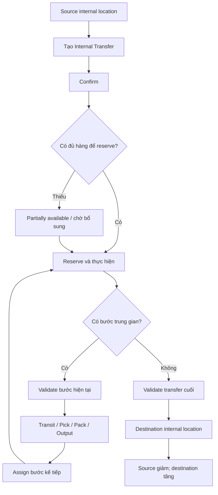
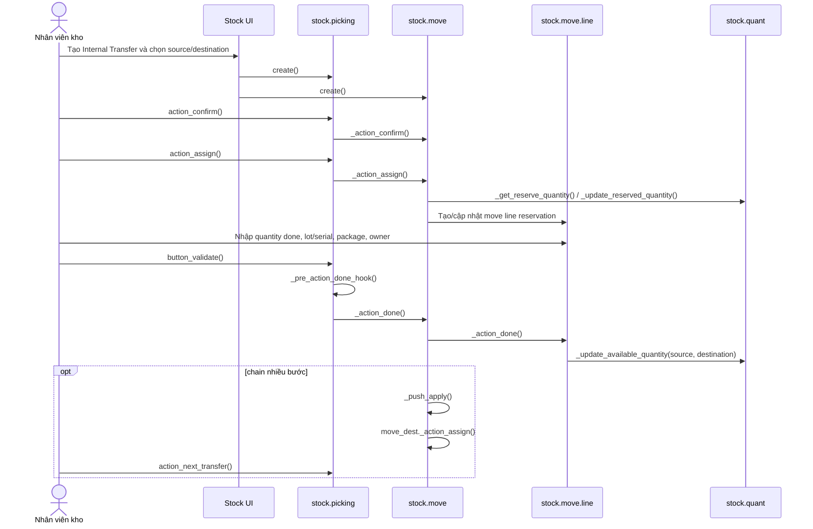

# WF-03 — Điều chuyển nội bộ (Internal Transfer)

## 1. Mục đích nghiệp vụ

Di chuyển hàng giữa hai location thuộc phạm vi internal/transit của Odoo. Đây là flow nội bộ kho; các phần nghiệp vụ tạo nhu cầu từ Mua hàng, Bán hàng hoặc Sản xuất sẽ được nối vào sau.

## 2. Đường đi của hàng

| Trường hợp | Đường đi | Operation type |
|---|---|---|
| Cùng warehouse | `WH/Stock A -> WH/Stock B` | `internal` |
| Giữa warehouse, không qua bước trung gian | `WH-A/Stock -> WH-B/Stock` | `internal` |
| Giữa warehouse, qua transit | `WH-A/Stock -> Transit -> WH-B/Input/Stock` | 2 hoặc nhiều `internal` |
| Nội bộ nhiều bước | `Source -> Pick/Pack/Output -> Destination` | các `internal` do rule tạo |

Source và destination có thể là location internal, transit hoặc location con hợp lệ. Supplier/Customer không phải path của flow này.

### 2.1. Sơ đồ hoạt động nghiệp vụ

### 2.2. Master data sử dụng

| Master data | Vai trò trong Internal Transfer | Mapping |
|---|---|---|
| Warehouse | Cung cấp operation type, location và route/rule | `stock.warehouse` |
| Location | Source/destination internal, transit hoặc location trung gian | `stock.location` |
| Operation Type | Chọn operation `internal` và chính sách reservation/backorder | `stock.picking.type` |
| Product/UoM | Hàng điều chuyển và cách quy đổi số lượng | `product.product`, `uom.uom` |
| Lot/Serial | Giữ traceability khi chuyển hàng có tracking | `stock.lot`, `stock.move.line` |
| Package/Owner | Giữ container và chủ sở hữu qua các bước | `stock.package`, `res.partner` |
| Route/Rule | Tạo push chain và các bước trung gian | `stock.route`, `stock.rule` |

Chi tiết master data dùng chung: [01_master_data.md](01_master_data.md).

## 3. Điều kiện đầu vào

- Có `stock.picking.type` với `code='internal'`, source/destination mặc định phù hợp.
- Source và destination thuộc cùng company hoặc được cấu hình cross-company/transit hợp lệ.
- Sản phẩm, UoM, tracking và owner hợp lệ.
- Source có quant khả dụng nếu operation cần reservation; location transit/view có thể bypass reservation theo usage.
- Nếu điều chuyển package, package không được chứa hàng ở nhiều location không nhất quán.

## 4. Flow nghiệp vụ đầu-cuối

| Bước | Nghiệp vụ | Đối tượng/kết quả | Mapping code 1:1 |
|---|---|---|---|
| I1 | Người dùng mở Internal Transfers | Chọn `stock.picking.type` có `code='internal'` | `stock.action_picking_tree_internal`; `stock.view_picking_form`; `stock.picking.type.code` |
| I2 | Tạo phiếu điều chuyển | Tạo `stock.picking` với source/destination và `stock.move` cho từng product | `stock.picking.create()`; `stock.move.create()`; fields `location_id`, `location_dest_id`, `picking_type_id` |
| I3 | Xác nhận nhu cầu chuyển | Move chuyển `draft -> confirmed` hoặc `waiting`; move liên kết được giữ nếu có chain | `stock.picking.action_confirm()` -> `stock.move._action_confirm()` |
| I4 | Reserve hàng tại source | Chọn quant theo product/source/lot/package/owner và removal strategy; tạo move line | `stock.picking.action_assign()` -> `stock.move._action_assign()` -> `_update_reserved_quantity()` -> `stock.quant._update_reserved_quantity()` |
| I5 | Thực hiện lấy và đặt hàng | Nhập quantity done, lot/serial, package nguồn/đích; đánh dấu dòng đã picked | `stock.move.line`; `stock.picking.action_detailed_operations()`; `stock.picking.action_put_in_pack()` |
| I6 | Validate phiếu | Kiểm tra quantity, tracking, package, company và backorder | `stock.picking.button_validate()` -> `_sanity_check()` -> `_pre_action_done_hook()` |
| I7 | Ghi nhận điều chuyển | Trừ quant source, tăng quant destination; unreserve phần source đã dùng | `stock.picking._action_done()` -> `stock.move._action_done()` -> `stock.move.line._action_done()` -> `stock.quant._update_available_quantity()` |
| I8 | Kích hoạt bước kế tiếp (nếu có) | Move destination được assign khi hàng đã tới location trung gian | `stock.move._push_apply()`; `move_dest_ids._action_assign()`; `stock.picking.action_next_transfer()` |
| I9 | Kết thúc | Phiếu cuối và các move liên quan ở `done`; tồn được phân bổ tại destination cuối | `stock.picking.date_done`; `stock.move.state='done'`; `stock.quant` theo destination |

### 4.1. Sơ đồ runtime/code

### 4.2. Nhánh reservation

- `reservation_method='at_confirm'`: thử reserve khi confirm.
- `manual`: người dùng phải Check Availability.
- `by_date`: assignment theo ngày reservation.
- Nếu source không đủ, move có thể `partially_available`; người dùng có thể điều chỉnh quantity done hoặc tạo backorder.
- `do_unreserve()` giải phóng reservation trước khi đổi lot/package/source.

### 4.3. Nhánh package

- Di chuyển nguyên package dùng `package_id`/`result_package_id`; operation type có thể bật `show_entire_packs`.
- Khi validate, `_action_done()` kiểm tra các quants dương trong cùng result package không nằm ở nhiều location.
- Package có thể đi qua nhiều bước mà vẫn giữ package identity; package history được tạo/cập nhật bởi stock execution.

### 4.4. Nhánh lot/serial/owner

- Lot/serial phải thuộc product; serial phải được ghi nhận theo đơn vị.
- `owner_id` giữ quyền sở hữu consignment; quant được phân biệt theo owner nên không được reserve chéo owner nếu strict.
- Khi move done, lot/package/owner của move line trở thành dimension của quant đích.

### 4.5. Nhánh nhiều bước / push rule

- Warehouse hoặc route tạo push rule từ source tới location kế tiếp.
- Validate move trước làm move destination có thể chuyển sang assigned; chưa có hàng thì destination giữ waiting/confirmed.
- `action_next_transfer()` mở transfer tiếp theo khi một chain có đúng một picking kế tiếp.
- Rule/procurement hiện chỉ được coi là cơ chế tạo move; phần scheduler và replenishment sẽ được bổ sung sau.

### 4.6. Nhánh thiếu số lượng

- `create_backorder='ask'`: mở `stock.backorder.confirmation`.
- `always`: tạo backorder cho phần chưa chuyển.
- `never`: cancel phần chưa chuyển.
- Với internal transfer nhiều bước, backorder giữ đúng source/destination của bước chưa hoàn tất.

### 4.7. Nhánh sau khi transfer hoàn tất

- `Backorder`: phần chưa chuyển đi qua `_check_backorder()` và wizard `stock.backorder.confirmation`; source/destination của phần còn lại được giữ trên picking mới.
- `Return transfer`: hàng đi ngược `Destination -> Source`; `stock.act_stock_return_picking` tạo picking return từ picking done, sau đó xử lý bằng confirm/assign/validate.
- `Scrap trong quá trình điều chuyển`: hàng tại location hiện tại đi tới scrap/inventory loss; `stock.picking.button_scrap()` -> `stock.scrap.action_validate()` -> `do_scrap()`.

## 5. Kết quả cuối

- Source quant giảm đúng quantity done; destination quant tăng cùng quantity và dimension lot/package/owner.
- Tổng tồn trong cùng cây location không đổi; tồn tại từng source/destination vẫn thay đổi theo quantity done.
- Mỗi transfer done có traceability qua `stock.move.line`, `stock.move`, `stock.picking`; các bước chain liên kết qua `move_orig_ids`/`move_dest_ids`.

## 6. Action hỗ trợ

| Action | Mục đích | Mapping |
|---|---|---|
| Mark as Todo | Xác nhận transfer | `stock.picking.action_confirm()` |
| Check Availability | Reserve source stock | `stock.picking.action_assign()` |
| Unreserve | Hủy reservation | `stock.picking.do_unreserve()` |
| Detailed Operations | Sửa quantity/lot/package/owner thực tế | `stock.picking.action_detailed_operations()` |
| Put in Pack | Đóng package đích | `stock.picking.action_put_in_pack()` |
| Validate | Ghi nhận di chuyển | `stock.action_validate_picking`; `stock.picking.button_validate()` |
| Next Transfer | Mở bước kế tiếp của chain | `stock.picking.action_next_transfer()` |
| Split Transfer | Tách phần đã làm và phần còn lại | `stock.picking.action_split_transfer()` |
| Backorder | Giữ phần chưa điều chuyển | `stock.picking._check_backorder()`; `stock.backorder.confirmation.process()` |
| Return | Đảo chiều transfer đã done | `stock.act_stock_return_picking`; `stock.return.picking._create_return()` |
| Scrap | Loại hàng hỏng/thiếu khỏi tồn | `stock.picking.button_scrap()`; `stock.scrap.action_validate()` |
| Cancel | Hủy transfer chưa done | `stock.picking.action_cancel()` |

## 7. Mã nguồn và test tham chiếu

| Nội dung | Source |
|---|---|
| Internal operation type | `addons/stock/models/stock_picking.py`: `stock.picking.type.code='internal'` |
| Picking lifecycle | `addons/stock/models/stock_picking.py`: `create()`, `action_confirm()`, `action_assign()`, `button_validate()`, `_action_done()`, `action_next_transfer()` |
| Move lifecycle | `addons/stock/models/stock_move.py`: `_action_confirm()`, `_action_assign()`, `_update_reserved_quantity()`, `_action_done()`, `_push_apply()` |
| Move line execution | `addons/stock/models/stock_move_line.py`: `_apply_putaway_strategy()`, `_action_done()` |
| Quant reservation/update | `addons/stock/models/stock_quant.py`: `_get_reserve_quantity()`, `_update_reserved_quantity()`, `_update_available_quantity()` |
| UI | `addons/stock/views/stock_picking_views.xml`: `view_picking_form`, `action_picking_tree_internal`, `action_validate_picking` |
| Basic internal move | `addons/stock/tests/test_warehouse.py::TestWarehouse.test_basic_move`; `addons/stock/tests/test_move_lines.py::TestStockMoveLine.test_pick_from_1` |
| Multi-step/package chain | `addons/stock/tests/test_stock_flow.py::TestStockFlow.test_40_pack_in_pack`; `addons/stock/tests/test_packing.py::TestPacking.test_move_picking_with_package` |
| Inter-warehouse/transit path | `addons/stock/tests/test_warehouse.py::TestWarehouse.test_mutiple_resupply_warehouse`; `test_muti_step_resupply_warehouse`; `addons/stock/tests/test_stock_flow.py::TestStockFlow.test_transit_multi_companies` |
