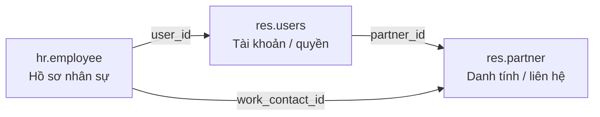
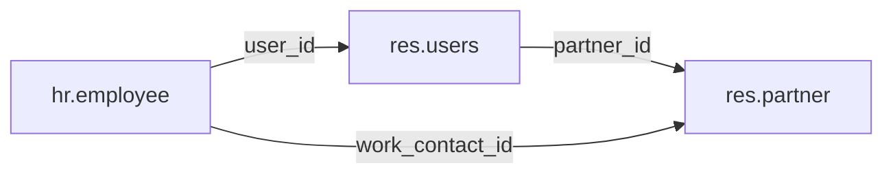

# Quan hệ `res.partner`, `res.users` và `hr.employee`

## 0. Câu mấu chốt

```text
res.partner  = danh tính/người hoặc công ty
res.users    = tài khoản đăng nhập + quyền
hr.employee  = hồ sơ nhân sự
```

Ba model tách các **vai trò** của cùng một người/công ty. Không phải bản ghi nào
cũng cần đủ cả ba: partner có thể không có user; employee có thể chưa có user.

## 1. Vai trò

| Model | Vai trò |
|---|---|
| `res.partner` | Hồ sơ liên hệ/đối tác (người, công ty, khách hàng, nhà cung cấp, địa chỉ...) |
| `res.users` | Tài khoản đăng nhập, quyền và cấu hình kỹ thuật |
| `hr.employee` | Hồ sơ nhân sự trong công ty (phòng ban, chức vụ, lịch làm việc, dữ liệu HR...) |

`res.partner` tồn tại độc lập; không phải partner nào cũng có tài khoản user.

## 2. Quan hệ dữ liệu



Quan hệ nên nhớ:



- `employee.user_id`: tài khoản Odoo của nhân viên; có thể để trống.
- `employee.user_id.partner_id`: partner gắn với tài khoản user.
- `employee.work_contact_id`: contact công việc của employee, là quan hệ trực tiếp tới partner.
- Hai partner ở hai đường trên thường giống nhau nhưng không bắt buộc phải là cùng một bản ghi.

Trong `res.users`:

```python
_inherits = {'res.partner': 'partner_id'}
partner_id = fields.Many2one('res.partner', required=True)
```

- Mỗi user bắt buộc có đúng một partner.
- Một partner có thể được nhiều user dùng chung (`partner.user_ids`).
- `partner.user_id` **không** phải inverse của `user.partner_id`; đó là salesperson phụ trách partner.

## 3. Dữ liệu nằm ở đâu?

### `res.partner`

```python
name, email, phone,
street, street2, city, state_id, zip, country_id,
vat, website, parent_id, child_ids
```

### `res.users`

```python
login, password, group_ids,
company_id, company_ids, active, share, partner_id
```

Các field user như `name`, `email`, `phone` được lấy từ partner:

```python
user.name       # tương đương user.partner_id.name
user.email      # tương đương user.partner_id.email
user.phone      # tương đương user.partner_id.phone
```

`password` được Odoo xử lý qua cơ chế bảo mật; không coi là mật khẩu thô để đọc trực tiếp.

## 4. Vì sao tách ba model?

- Nhiều đối tác không cần đăng nhập.
- Nhiều user có thể dùng chung một partner (ví dụ nhiều tài khoản của cùng công ty).
- Thông tin nghiệp vụ (khách hàng, nhà cung cấp, hóa đơn, giao hàng, email...) không phụ thuộc vòng đời tài khoản.
- Quyền/login của user được tách khỏi tên, địa chỉ, email của partner.

Trong HR, việc tách thành ba model cho phép:

- Quản lý employee dù chưa cấp tài khoản.
- Cấp/khóa user mà không làm mất hồ sơ employee hay lịch sử nghiệp vụ.
- Giữ dữ liệu HR nhạy cảm (`department_id`, `job_title`, lương, thông tin riêng tư)
  ngoài hồ sơ liên hệ chung của partner.

## 5. Ví dụ

```python
partner = env['res.partner'].create({
    'name': 'Công ty ABC',
    'email': 'contact@abc.com',
})

user = env['res.users'].create({
    'partner_id': partner.id,
    'login': 'abc_user',
})
```

Kết quả:

```python
user.partner_id == partner
partner.user_ids       # các user dùng partner này
partner.main_user_id   # user đại diện (nếu cần một user)
```

## 6. Source cần đọc

```text
oodo/addons/base/models/res_partner.py
oodo/addons/base/models/res_users.py
oodo/addons/base/views/res_partner_views.xml
oodo/addons/base/views/res_users_views.xml
```

Đọc trước phần `class ResPartner`, `class ResUsers`, `_inherits`, `partner_id`, `user_ids`, `main_user_id`.

Để xem quan hệ với HR:

```text
addons/hr/models/hr_employee.py
addons/hr/models/res_users.py
addons/hr/views/hr_employee_views.xml
```
