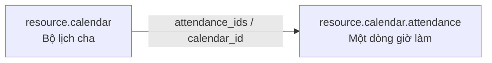

# `resource.calendar.attendance` trong Odoo

## 1. Tóm tắt một câu

`resource.calendar.attendance` là **một dòng chi tiết trong một bộ lịch làm việc**. Mỗi record quy định resource làm vào **thứ nào, từ mấy giờ đến mấy giờ** theo lịch lặp hàng tuần.

> Tên `attendance` ở đây không có nghĩa là check-in/check-out thực tế. Đây là giờ làm việc **dự kiến theo lịch chuẩn**.

## 2. Vị trí mã nguồn

- Model: `addons/resource/models/resource_calendar_attendance.py`
- Khai báo model: `class ResourceCalendarAttendance(models.Model)` với `_name = 'resource.calendar.attendance'`
- Calendar cha: `addons/resource/models/resource_calendar.py`
- View: `addons/resource/views/resource_calendar_views.xml`

Trong database, tên bảng thường là:

```text
resource_calendar_attendance
```

## 3. Attendance record thể hiện gì?

Ví dụ calendar có tên `Lịch hành chính`. Các attendance record của nó có thể là:

```text
Thứ 2 | 08:00–12:00
Thứ 2 | 13:00–17:00
Thứ 3 | 08:00–12:00
Thứ 3 | 13:00–17:00
```

Mỗi dòng là một khoảng giờ làm lặp lại theo thứ trong tuần. Nó không đại diện cho một ngày cụ thể như ngày 10/09/2026.

## 4. Quan hệ trực tiếp



- `resource.calendar` có nhiều `attendance_ids`.
- Mỗi attendance bắt buộc thuộc về một calendar qua `calendar_id`.
- Khi xóa calendar, attendance liên quan bị xóa theo (`ondelete='cascade'`).

## 5. Các field quan trọng

| Field | Ý nghĩa |
|---|---|
| `name` | Tên dòng giờ làm; bắt buộc. |
| `calendar_id` | Calendar cha mà dòng này thuộc về; bắt buộc. |
| `dayofweek` | Ngày trong tuần: `0` Thứ 2 đến `6` Chủ nhật. |
| `hour_from` | Giờ bắt đầu làm, dạng số thực; ví dụ `8.0` là 08:00. |
| `hour_to` | Giờ kết thúc làm; `24:00` được xử lý như cuối ngày. |
| `duration_hours` | Thời lượng giờ của dòng; được tính từ `hour_to - hour_from`, trừ dòng nghỉ trưa. |
| `duration_days` | Thời lượng quy đổi theo ngày: 0, 0.5 hoặc 1. |
| `day_period` | Buổi: `morning`, `lunch`, `afternoon`, `full_day`. |
| `week_type` | Tuần thứ nhất/thứ hai khi calendar chạy chế độ hai tuần. |
| `two_weeks_calendar` | Related field cho biết calendar cha có chạy hai tuần không. |
| `duration_based` | Related field cho biết calendar tính theo thời lượng hay khung giờ cố định. |
| `display_type` | Dòng kỹ thuật dùng làm section trong giao diện, không phải khoảng giờ làm. |
| `sequence` | Thứ tự hiển thị dòng trong calendar. |

## 6. Những field cần nhớ nhất

```text
calendar_id → Dòng này thuộc bộ lịch nào?
dayofweek   → Làm vào thứ mấy?
hour_from   → Bắt đầu lúc mấy giờ?
hour_to     → Kết thúc lúc mấy giờ?
day_period  → Sáng, nghỉ trưa, chiều hay cả ngày?
```

Ví dụ:

```text
calendar_id: Lịch hành chính
 dayofweek: Thứ 2
 hour_from: 8.0
 hour_to: 12.0
 day_period: morning
```

Nghĩa là:

> Trong lịch hành chính, resource làm vào mỗi thứ 2 từ 08:00 đến 12:00.

## 7. `day_period` và thời lượng

Các giá trị của `day_period`:

- `morning`: buổi sáng
- `lunch`: giờ nghỉ trưa
- `afternoon`: buổi chiều
- `full_day`: cả ngày

Với dòng `lunch`, `duration_hours` được tính bằng `0` vì đây là khoảng nghỉ, không phải giờ làm.

`duration_days` được tính như sau:

```text
lunch    → 0 ngày
full_day → 1 ngày
morning/afternoon → thường 0.5 hoặc 1 ngày tùy thời lượng
```

## 8. Calendar hai tuần

Nếu calendar cha bật `two_weeks_calendar`, attendance có thể thuộc:

```text
First week  → Tuần thứ nhất
Second week → Tuần thứ hai
```

Nhờ vậy có thể định nghĩa lịch luân phiên hai tuần, ví dụ tuần 1 làm thứ 2/4/6 và tuần 2 làm thứ 3/5/7.

## 9. Các method nên đọc trước

### `_onchange_hours()`

Giới hạn giờ trong khoảng hợp lệ và ngăn `hour_to` nhỏ hơn `hour_from`.

### `_check_day_period()`

Không cho tạo dòng `lunch` trên calendar tính theo duration.

### `get_week_type(date)`

Xác định ngày thuộc tuần thứ nhất hay thứ hai trong lịch hai tuần.

### `_compute_duration_hours()`

Tính số giờ từ `hour_from` và `hour_to`; dòng nghỉ trưa có thời lượng 0.

### `_compute_duration_days()`

Quy đổi thời lượng dòng lịch thành số ngày.

### `_is_work_period()`

Kiểm tra dòng có phải khoảng làm việc thật hay là dòng nghỉ trưa/section.

## 10. Phân biệt với `hr.attendance`

| Model | Ý nghĩa |
|---|---|
| `resource.calendar.attendance` | Lịch chuẩn: thứ nào resource dự kiến làm, giờ nào làm |
| `hr.attendance` | Chấm công thực tế: nhân viên check-in/check-out lúc nào |

Ví dụ:

```text
resource.calendar.attendance:
    Mỗi thứ 2, 08:00–12:00

hr.attendance:
    Ngày 10/09/2026, check-in 08:07, check-out 17:10
```

## 11. Kết luận

`resource.calendar.attendance` là **bản ghi con mô tả một khung giờ làm việc lặp lại trong tuần**. Nó phải thuộc một `resource.calendar` và dùng các field `dayofweek`, `hour_from`, `hour_to` để định nghĩa thời gian làm việc chuẩn.
