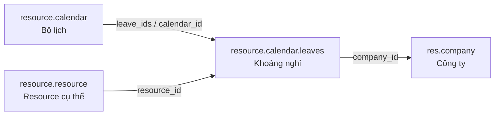

# `resource.calendar.leaves` trong Odoo

## 1. Tóm tắt một câu

`resource.calendar.leaves` là **một bản ghi mô tả khoảng thời gian resource không làm việc hoặc không khả dụng**, thường dùng cho ngày lễ, nghỉ phép, bảo trì máy hoặc các ngoại lệ của lịch làm việc.

Nếu:

```text
resource.calendar.attendance = Theo lịch chuẩn, lúc nào được làm?
resource.calendar.leaves     = Ngoại lệ, lúc nào không làm/không khả dụng?
```

## 2. Vị trí mã nguồn

- Model: `addons/resource/models/resource_calendar_leaves.py`
- Khai báo model: `class ResourceCalendarLeaves(models.Model)` với `_name = 'resource.calendar.leaves'`
- View: `addons/resource/views/resource_calendar_leaves_views.xml`
- Calendar cha: `addons/resource/models/resource_calendar.py`

Trong database, tên bảng thường là:

```text
resource_calendar_leaves
```

## 3. Leave record thể hiện gì?

Một leave là một khoảng thời gian cụ thể:

```text
Tên: Nghỉ lễ Quốc khánh
Từ: 02/09/2026 00:00
Đến: 02/09/2026 23:59
```

Hoặc:

```text
Tên: Nghỉ phép
Từ: 10/09/2026 13:00
Đến: 12/09/2026 17:00
Resource: Nguyễn Văn A
```

Leave không nhất thiết chỉ kéo dài một ngày; nó có thể dài vài giờ, một ngày hoặc nhiều ngày.

## 4. Quan hệ trực tiếp



Các quan hệ cần hiểu:

- `calendar_id`: leave thuộc calendar nào.
- `resource_id`: leave áp dụng cho resource cụ thể nào.
- `company_id`: công ty liên quan; field này được tính từ calendar.

## 5. Leave chung và leave riêng

### Leave chung

Nếu `resource_id` để trống:

```text
resource_id = False
```

thì leave là **nghỉ chung** cho calendar/công ty.

Ví dụ:

```text
Ngày lễ 02/09 áp dụng cho toàn công ty
```

### Leave riêng cho resource

Nếu có `resource_id`:

```text
resource_id = Nguyễn Văn A
```

thì leave chỉ áp dụng cho resource đó.

Ví dụ:

```text
Nguyễn Văn A nghỉ phép ngày 10/09/2026
```

## 6. Các field quan trọng

| Field | Ý nghĩa |
|---|---|
| `name` | Lý do/tên khoảng nghỉ. |
| `calendar_id` | Calendar liên quan; có thể được tính theo resource. |
| `resource_id` | Resource cụ thể nghỉ; để trống nếu là nghỉ chung. |
| `company_id` | Công ty liên quan; readonly và được tính từ calendar. |
| `date_from` | Thời điểm bắt đầu nghỉ; bắt buộc. |
| `date_to` | Thời điểm kết thúc nghỉ; bắt buộc. |
| `time_type` | `leave` nếu là thời gian nghỉ; `other` nếu là khoảng không làm nhưng vẫn tính như thời gian làm, ví dụ đào tạo. |

## 7. `time_type` có ý nghĩa gì?

```python
('leave', 'Time Off')
('other', 'Other')
```

- `leave`: loại khỏi thời gian làm việc, ví dụ nghỉ phép/nghỉ lễ.
- `other`: khoảng thời gian đặc biệt không theo attendance nhưng có thể được tính như work time, ví dụ đào tạo.

Vì vậy `leaves` không phải lúc nào cũng có nghĩa là “nghỉ phép”; model này còn lưu các khoảng ngoại lệ của calendar.

## 8. Ngày giờ và múi giờ

`date_from` và `date_to` là `Datetime`, không phải chỉ là ngày.

Khi tạo record mới, `default_get()` thường đặt mặc định khoảng thời gian là cả ngày hiện tại theo múi giờ của calendar:

```text
00:00:00 đến 23:59:59 theo timezone của calendar
```

Sau đó Odoo chuyển giá trị về dạng UTC để lưu trữ.

Vì vậy khi đọc code hoặc database, cần nhớ:

```text
Giờ hiển thị trên giao diện có thể khác giờ lưu trong database
do chuyển đổi múi giờ.
```

## 9. Các method nên đọc trước

### `default_get()`

Tạo mặc định `date_from` và `date_to` cho cả ngày hiện tại, dựa trên múi giờ của calendar.

### `_compute_calendar_id()`

Nếu leave có `resource_id`, calendar được lấy từ calendar của resource đó.

### `_compute_company_id()`

Công ty được lấy từ calendar; nếu calendar không có company thì dùng company hiện tại.

### `_compute_date_to()`

Nếu chưa có ngày kết thúc phù hợp, tự đặt thời điểm kết thúc về cuối ngày theo timezone người dùng/công ty.

### `check_dates()`

Đảm bảo thời điểm bắt đầu không lớn hơn thời điểm kết thúc.

## 10. Leave tác động lên lịch như thế nào?

Odoo kết hợp attendance và leave để tính thời gian khả dụng:

```text
Khung giờ làm chuẩn từ resource.calendar.attendance
    - Khoảng nghỉ từ resource.calendar.leaves
    = Khoảng thời gian resource thực sự khả dụng
```

Ví dụ:

```text
Attendance:
    Thứ 2, 08:00–17:00

Leave:
    Thứ 2, 13:00–17:00

Khả dụng thực tế:
    Thứ 2, 08:00–13:00
```

## 11. Phân biệt với các model dễ nhầm

| Model | Ý nghĩa |
|---|---|
| `resource.calendar.leaves` | Khoảng nghỉ/ngoại lệ dùng để tính lịch resource |
| `hr.leave` | Đơn nghỉ phép trong nghiệp vụ HR |
| `hr.attendance` | Check-in/check-out thực tế |
| Timesheet | Giờ thực tế ghi cho project/task |

Một đơn `hr.leave` có thể tạo hoặc dẫn tới khoảng không khả dụng trên resource, nhưng hai model này không phải cùng một thứ.

## 12. Kết luận

`resource.calendar.leaves` là **bản ghi con lưu các khoảng thời gian ngoại lệ của một calendar**. Nó có thể là nghỉ chung cho công ty/calendar hoặc nghỉ riêng cho một resource cụ thể. Odoo dùng leave để trừ khỏi các khung giờ làm chuẩn và tính thời gian resource thực sự không khả dụng.
