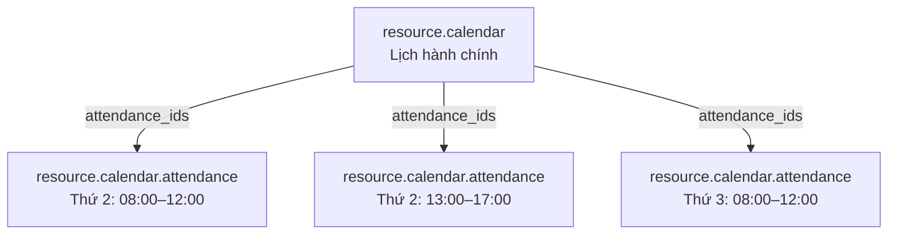
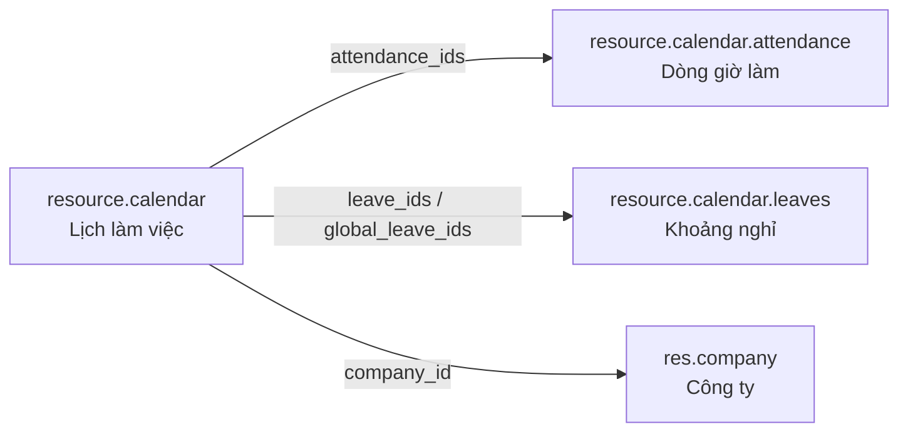

# `resource.calendar` trong Odoo

## 1. Tóm tắt một câu

`resource.calendar` là **một bản ghi đại diện cho một bộ lịch làm việc**. Odoo có thể có nhiều bộ lịch khác nhau (lịch hành chính, lịch ca đêm, lịch bán thời gian, lịch vận hành máy). Mỗi bộ lịch có thông tin chung ở `resource.calendar`, còn các khung giờ chi tiết của bộ lịch đó được lưu thành nhiều bản ghi con trong `resource.calendar.attendance`.

Nếu:

```text
resource.resource = Người/máy nào cần quản lý lịch?
resource.calendar = Người/máy đó làm việc theo thời khóa biểu nào?
```

Ví dụ một bản ghi calendar có thể là:

```text
Lịch hành chính
├── Thứ 2–Thứ 6
├── 08:00–12:00
├── 13:00–17:00
└── Múi giờ: Asia/Ho_Chi_Minh
```

## 2. Vị trí mã nguồn

- Model: `addons/resource/models/resource_calendar.py`
- Khai báo model: `class ResourceCalendar(models.Model)` với `_name = 'resource.calendar'`
- View: `addons/resource/views/resource_calendar_views.xml`
- Model dòng giờ làm: `addons/resource/models/resource_calendar_attendance.py`
- Model khoảng nghỉ: `addons/resource/models/resource_calendar_leaves.py`

Trong database, tên bảng thường là:

```text
resource_calendar
```

## 3. Vì sao model này tồn tại?

Odoo cần một nơi dùng chung để định nghĩa lịch hoạt động. HR dùng lịch cho nhân viên; Planning dùng lịch để xếp ca; Project dùng lịch để tính deadline; MRP dùng lịch để tính thời gian máy chạy.

Thay vì mỗi module tự định nghĩa thứ và giờ làm, tất cả cùng dùng `resource.calendar`.

## 4. Calendar và các dòng chi tiết: quan hệ cha–con

Đây là phần cần hiểu trước khi đọc code:

```text
resource.calendar
    = Bản ghi cha đại diện cho một bộ lịch
      Ví dụ: "Lịch hành chính"

resource.calendar.attendance
    = Các bản ghi con chứa chi tiết của bộ lịch đó
      Ví dụ: Thứ 2, 08:00–12:00
```

Một calendar có **nhiều** attendance line:



Vì vậy, **calendar không phải một dòng giờ cụ thể**. Nó là tên và cấu hình chung của cả bộ lịch; `attendance_ids` là danh sách các dòng chi tiết thuộc bộ lịch đó.

> `resource.calendar.attendance` cũng không phải dữ liệu check-in/check-out thực tế. Nó mô tả giờ làm việc lặp lại theo lịch chuẩn. Dữ liệu chấm công thực tế nằm ở `hr.attendance`.

## 5. Các field quan trọng

`resource.calendar` lưu cấu hình của một **lịch làm việc**, còn chi tiết từng dòng giờ nằm trong `resource.calendar.attendance`.

| Field | Ý nghĩa |
|---|---|
| `name` | Tên lịch, ví dụ `Lịch hành chính`, `Lịch ca đêm`. |
| `attendance_ids` | Các dòng giờ làm trong tuần (`resource.calendar.attendance`). Đây là field cốt lõi. |
| `company_id` | Công ty sở hữu/sử dụng lịch. |
| `leave_ids` | Các khoảng nghỉ liên kết với calendar (`resource.calendar.leaves`). |
| `global_leave_ids` | Các ngày nghỉ chung của calendar, không gắn với resource cụ thể (`resource_id = False`). |
| `schedule_type` | Kiểu lịch: `flexible` hoặc `fully_fixed`. |
| `flexible_hours` | Cho biết lịch có làm việc linh hoạt hay không; được tính từ `schedule_type`. |
| `hours_per_day` | Số giờ làm trung bình mỗi ngày. |
| `hours_per_week` | Tổng số giờ làm trung bình mỗi tuần. |
| `full_time_required_hours` | Số giờ cần làm theo lịch công ty để được xem là full-time. |
| `tz` | Múi giờ áp dụng cho lịch, ví dụ `Asia/Ho_Chi_Minh`. |
| `two_weeks_calendar` | Bật lịch lặp theo chu kỳ hai tuần. |
| `active` | Ẩn lịch không còn sử dụng mà không xóa record. |
| `work_resources_count` | Số resource đang sử dụng calendar này. |
| `work_time_rate` | Tỷ lệ thời gian làm việc so với lịch full-time. |

### Field cốt lõi: `attendance_ids`

```python
attendance_ids = fields.One2many(
    'resource.calendar.attendance',
    'calendar_id',
    'Working Time',
)
```

Field này chứa các khung giờ làm cụ thể:

```text
Thứ 2: 08:00–12:00, 13:00–17:00
Thứ 3: 08:00–12:00, 13:00–17:00
...
```

`attendance` trong model này **không phải** check-in/check-out của nhân viên. Nó chỉ có nghĩa là:

> Theo lịch chuẩn, resource được làm trong khung giờ này.

### `schedule_type`: lịch cố định hay linh hoạt

```python
('flexible', 'Flexible')
('fully_fixed', 'Fully Fixed')
```

- `fully_fixed`: định nghĩa rõ ngày nào, giờ nào làm.
- `flexible`: chủ yếu quy định số giờ cần làm trong tuần/ngày, không bắt buộc một khung giờ cố định.

`flexible_hours` được tính tự động:

```python
calendar.flexible_hours = calendar.schedule_type == 'flexible'
```

### `leave_ids` và `global_leave_ids`

- `leave_ids`: các khoảng nghỉ gắn với calendar; có thể là nghỉ chung hoặc gắn với một resource.
- `global_leave_ids`: chỉ các khoảng nghỉ chung, không gắn với resource cụ thể.

Ví dụ:

```text
Ngày Quốc khánh → nghỉ chung cho toàn lịch
Nhân viên A nghỉ phép → nghỉ riêng cho resource của A
```

## 6. Quan hệ trực tiếp của model



`resource.resource` sử dụng calendar qua field `calendar_id`, nhưng quan hệ đó được khai báo ở phía `resource.resource`. Chi tiết sâu hơn về resource và cách nó chọn calendar nằm trong tài liệu `resource_resource_vi.md`.

## 7. Luồng ví dụ

Tạo một calendar:

```text
Name: Lịch hành chính
Company: Công ty ABC
Schedule Type: Fully Fixed
Timezone: Asia/Ho_Chi_Minh
```

Các dòng `attendance_ids`:

```text
Thứ 2–Thứ 6: 08:00–12:00
Thứ 2–Thứ 6: 13:00–17:00
```

Sau đó gắn calendar này cho resource:

```text
Nguyễn Văn A → calendar_id = Lịch hành chính
Trần Thị B   → calendar_id = Lịch hành chính
```

Kết quả: cả hai resource dùng chung cùng một thời khóa biểu. Khi Odoo cần tính thời gian làm việc, nó lấy các dòng attendance và trừ đi các khoảng leave.

## 8. Các method nên đọc trước

### `default_get()`

Tạo giá trị mặc định khi mở form calendar:

- Tự đặt tên theo công ty.
- Tạo các dòng giờ làm mặc định.
- Lấy cấu hình hai tuần và số giờ full-time từ calendar của công ty.

### `_check_attendance_ids()`

Kiểm tra các dòng giờ làm không bị chồng lấn. Với lịch hai tuần, method cũng kiểm tra riêng từng tuần.

### `_compute_attendance_ids()`

Khi đổi công ty, calendar có thể sao chép lịch làm việc từ calendar mặc định của công ty.

### `_compute_hours_per_day()` và `_compute_hours_per_week()`

Tính số giờ trung bình mỗi ngày và tổng số giờ mỗi tuần dựa trên `attendance_ids`.

### `_compute_flexible_hours()`

Chuyển `schedule_type` thành trạng thái linh hoạt (`flexible_hours`).

### Các method tính khoảng thời gian

Trong phần còn lại của file có các method tính:

- Khoảng giờ làm việc.
- Khoảng nghỉ.
- Thời gian bắt đầu/kết thúc gần nhất.
- Khoảng thời gian theo múi giờ.
- Lịch một tuần hoặc hai tuần.

Đây là phần được các module HR, Planning, Project và MRP gọi để tính resource có thể làm việc lúc nào.

## 9. Phân biệt với các khái niệm dễ nhầm

| Khái niệm | Vai trò |
|---|---|
| `resource.resource` | Người/máy/tài sản nào được xếp lịch? |
| `resource.calendar` | Lịch làm việc của resource là gì? |
| `resource.calendar.attendance` | Chi tiết các khung giờ làm việc theo ngày trong tuần |
| `resource.calendar.leaves` | Khoảng nghỉ/không khả dụng |
| `hr.attendance` | Nhân viên check-in/check-out thực tế lúc nào? |
| Timesheet | Nhân viên đã dùng bao nhiêu giờ cho project/task nào? |

## 10. Cách học model này

Đọc theo thứ tự:

1. Docstring của `ResourceCalendar` để hiểu `attendance_ids`, `leave_ids` và khái niệm interval.
2. Các field `name`, `attendance_ids`, `company_id`, `leave_ids`, `schedule_type`, `tz`.
3. `resource_calendar_attendance.py` để biết một dòng giờ làm lưu ngày/giờ như thế nào.
4. `default_get()` và các method compute để hiểu dữ liệu mặc định và số giờ được tính ra sao.
5. Các method tính intervals để hiểu cách Odoo biến lịch thành các khoảng thời gian làm việc.

## 11. Kết luận

`resource.calendar` là **bản ghi cha của một bộ thời khóa biểu dùng chung cho resource**. Nó định nghĩa cấu hình chung như tên, công ty, múi giờ và kiểu lịch; các khung giờ cụ thể được lưu ở nhiều bản ghi `resource.calendar.attendance`, còn các khoảng nghỉ được lưu ở `resource.calendar.leaves`.

```text
resource.resource = Ai/cái gì được xếp lịch?
resource.calendar = Lịch của đối tượng đó như thế nào?
resource.calendar.attendance = Cụ thể làm ngày nào, giờ nào?
resource.calendar.leaves = Khi nào nghỉ hoặc không khả dụng?
```
