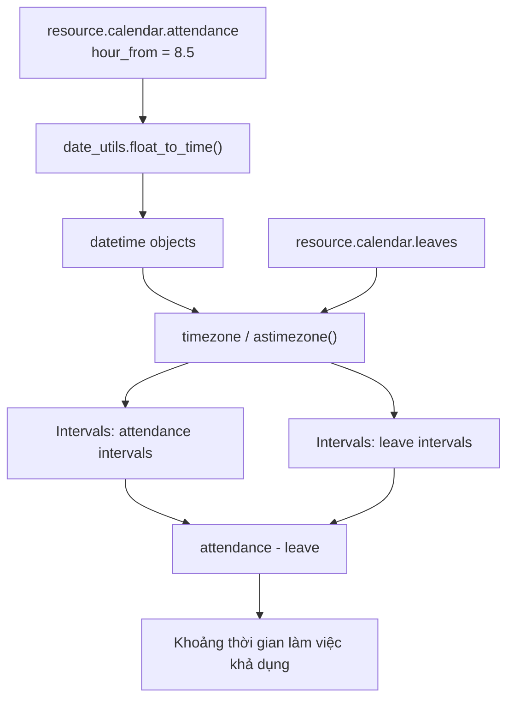

# Core utilities dùng bởi `resource`: Date/Datetime, timezone, `date_utils`, `Intervals`

## 1. Mục đích của tài liệu

Module `resource` không tự định nghĩa toàn bộ logic ngày-giờ. Nó sử dụng các utility có sẵn của Python, thư viện `pytz` và Odoo core để biến lịch làm việc/nghỉ thành các khoảng thời gian có thể tính toán.

Luồng khái quát:

```text
resource.calendar.attendance
    + resource.calendar.leaves
            ↓
Date/Datetime + timezone + date_utils
            ↓
Intervals
            ↓
Khoảng làm việc / nghỉ / khả dụng
```

Các thành phần chính trong tài liệu này:

```text
Date / Datetime
    → kiểu ngày và ngày-giờ của Odoo

 timezone
    → chuyển đổi giữa các múi giờ

 date_utils
    → helper xử lý ngày-giờ của Odoo

 Intervals
    → cấu trúc lưu và tính toán nhiều khoảng thời gian
```

## 2. Bản đồ code nhanh

| Utility | Định nghĩa | Call site trực tiếp trong `resource` | Vai trò |
|---|---|---|---|
| `Date`, `Datetime` | `odoo/orm/fields_temporal.py` | `fields.Date`, `fields.Datetime` trong các model | Khai báo field ngày/ngày-giờ |
| `datetime`, `time`, `timedelta` | Python `datetime` | `resource_calendar.py`, `resource_calendar_leaves.py` | Tạo mốc và cộng/trừ thời gian |
| `timezone`, `utc` | `pytz` | `from pytz import timezone, utc` | Chuyển múi giờ |
| `float_to_time` | `odoo/tools/date_utils.py` | `_attendance_intervals_batch()` | Đổi `8.5` thành `08:30` |
| `localized` | `odoo/tools/date_utils.py` | `resource_resource.py`, `resource_calendar.py` | Bổ sung/giữ timezone cho datetime |
| `to_timezone` | `odoo/tools/date_utils.py` | `resource_resource.py` | Tạo hàm chuyển datetime về timezone đích |
| `Intervals` | `odoo/tools/intervals.py` | Các method `_*_intervals*()` | Lưu, giao, hợp, trừ khoảng thời gian |

Quan hệ giữa nơi gọi và nơi định nghĩa:

```text
addons/resource/models/resource_calendar.py
    → gọi các utility dùng chung
        → utility được định nghĩa trong odoo/orm hoặc odoo/tools
```

Ví dụ:

```text
_attendance_intervals_batch()
    → float_to_time()
    → Intervals()

_work_intervals_batch()
    → _attendance_intervals_batch()
    → _leave_intervals_batch()
    → Intervals.__sub__()
```

## 3. Các file cần đọc

| Thành phần | File |
|---|---|
| Field `Date`, `Datetime` | `odoo/orm/fields_temporal.py` |
| Helper ngày-giờ | `odoo/tools/date_utils.py` |
| Cấu trúc khoảng thời gian | `odoo/tools/intervals.py` |
| Kiểu `datetime`, `time`, `timedelta` | Python standard library, module `datetime` |
| `timezone`, `utc` | Thư viện `pytz` |
| Cách resource sử dụng chúng | `addons/resource/models/resource_calendar.py`, `addons/resource/models/resource_resource.py` |

## 4. `Date` và `Datetime` của Odoo

### 4.1. Đây là field của Odoo, không phải model nghiệp vụ

Nguồn:

```text
odoo/orm/fields_temporal.py
```

Khai báo trong model:

```python
some_date = fields.Date()
some_datetime = fields.Datetime()
```

- `fields.Date`: chỉ ngày, ví dụ `2026-09-10`.
- `fields.Datetime`: ngày và giờ, ví dụ `2026-09-10 08:30:00`.

Cần phân biệt:

```python
fields.Datetime  # field type của Odoo
 datetime        # class datetime của Python
```

### 4.2. Các hàm quan trọng của `Date`

```python
fields.Date.today()
fields.Date.context_today(record)
fields.Date.to_date(value)
fields.Date.to_string(value)
```

#### `Date.today()`

Trả về ngày hiện tại theo server/Python.

#### `Date.context_today(record)`

Trả về ngày hiện tại theo timezone của environment/user. Đây thường là lựa chọn phù hợp hơn khi làm nghiệp vụ Odoo.

Cùng một thời điểm UTC có thể là ngày khác nhau ở các timezone:

```text
UTC:                 2026-09-09 17:00
Asia/Ho_Chi_Minh:    2026-09-10 00:00
```

#### `Date.to_date(value)`

Chuyển string/date/datetime thành `date`. Nếu đưa datetime vào, phần giờ và timezone bị loại bỏ.

### 4.3. Các hàm quan trọng của `Datetime`

```python
fields.Datetime.now()
fields.Datetime.today()
fields.Datetime.context_timestamp(record, timestamp)
fields.Datetime.to_datetime(value)
```

#### `Datetime.now()`

Lấy thời điểm hiện tại theo quy ước ORM của Odoo. Dùng cho default value của field datetime.

#### `Datetime.today()`

Lấy ngày hiện tại nhưng đặt giờ về `00:00:00`.

#### `Datetime.context_timestamp(record, timestamp)`

Chuyển một datetime UTC dạng naive sang datetime có timezone của user/context.

> Với field datetime, Odoo thường lưu/trao đổi theo UTC rồi chuyển sang timezone khi hiển thị. Vì vậy phải phân biệt “giờ lưu trữ” và “giờ hiển thị”.

## 5. `datetime`, `time`, `timedelta` của Python

Trong `resource.calendar` có import:

```python
from datetime import datetime, time, timedelta
```

Đây là công cụ gốc của Python:

```python
datetime.now()                 # ngày + giờ
time(8, 30)                    # giờ trong ngày
timedelta(days=1, hours=2)     # khoảng chênh lệch
```

Resource dùng chúng để:

- Tạo mốc bắt đầu/kết thúc ngày.
- Cộng/trừ ngày và giờ.
- Tạo khoảng thời gian cho attendance và leave.
- Tính độ dài giữa hai mốc thời gian.

## 6. Timezone

### 5.1. Nguồn

Resource dùng timezone từ `pytz`:

```python
from pytz import timezone, utc
```

Ví dụ:

```python
vn_tz = timezone('Asia/Ho_Chi_Minh')
local_dt = utc_dt.astimezone(vn_tz)
```

### 5.2. Các thao tác cần hiểu

```python
utc.localize(naive_dt)
aware_dt.astimezone(target_tz)
```

- `localize()`: gắn timezone vào datetime chưa có `tzinfo`.
- `astimezone()`: chuyển một datetime đã có timezone sang timezone khác.

### 5.3. Vì sao `resource` cần timezone?

Một calendar có thể quy định:

```text
08:00–17:00
```

Nhưng 08:00 ở Việt Nam không giống 08:00 ở New York. Khi tính lịch, Odoo phải biết:

- Resource ở múi giờ nào.
- Calendar dùng múi giờ nào.
- Datetime đầu vào đang là UTC hay local time.

Trong source resource thường thấy:

```python
start_dt.astimezone(tz)
tz.localize(...)
```

## 7. `date_utils`

### 6.1. Vị trí

```text
odoo/tools/date_utils.py
```

Đây là bộ helper ngày-giờ dùng chung trong toàn Odoo.

Trong resource, các hàm quan trọng nhất là:

```python
from odoo.tools.date_utils import (
    float_to_time,
    localized,
    to_timezone,
)
```

### 6.2. `float_to_time(hours)`

Chuyển giờ dạng số thực thành `datetime.time`:

```python
float_to_time(8.5)
# 08:30
```

Attendance lưu giờ thường dưới dạng số:

```python
hour_from = 8.5
hour_to = 17.0
```

Khi tạo datetime, resource chuyển chúng thành giờ thật:

```text
8.5 → 08:30
17.0 → 17:00
```

Giá trị `24.0` được coi là cuối ngày (`23:59:59.999999`).

### 6.3. `localized(dt)`

Nếu datetime chưa có timezone, hàm gắn UTC vào; nếu đã có timezone thì giữ nguyên:

```python
localized(naive_dt)
```

Mục đích là tránh việc so sánh hoặc tính toán lẫn lộn giữa:

```text
naive datetime       # không có timezone
aware datetime       # có timezone
```

### 6.4. `to_timezone(tz)`

Trả về một hàm chuyển datetime sang timezone đích:

```python
convert = to_timezone(timezone('Asia/Ho_Chi_Minh'))
local_dt = convert(dt)
```

Nếu truyền `None`, helper chuyển về UTC rồi loại `tzinfo` theo quy ước của Odoo.

### 6.5. Helper khác nên đọc sau

```text
time_to_float()
date_range()
parse_date()
parse_iso_date()
sum_intervals()
get_timedelta()
```

Khi học `resource`, ưu tiên trước:

```text
float_to_time()
localized()
to_timezone()
```

## 8. `Intervals`

### 7.1. Vị trí

```text
odoo/tools/intervals.py
```

`Intervals` là một cấu trúc của Odoo dùng để lưu một tập các khoảng thời gian có thứ tự.

Một item có dạng:

```python
(start, stop, metadata)
```

Ví dụ:

```python
Intervals([
    (start_1, end_1, attendance_1),
    (start_2, end_2, attendance_2),
])
```

Trong resource, metadata thường là record của attendance hoặc leave.

### 7.2. Vì sao cần `Intervals`?

Một ngày có thể có nhiều đoạn làm việc:

```text
08:00–12:00
13:00–17:00
```

Một leave có thể cắt ngang một đoạn:

```text
10:00–11:00
```

Odoo phải tính được phần còn lại:

```text
08:00–10:00
11:00–12:00
13:00–17:00
```

### 7.3. Các phép toán chính

```python
work - leave   # phần làm việc sau khi trừ nghỉ
work & other   # phần giao nhau
work | other   # hợp/gộp các khoảng
```

Tương ứng với các operator trong class:

```python
__sub__()  # phép trừ
__and__()  # phép giao
__or__()   # phép hợp
```

Ví dụ:

```text
Work:
    08:00–12:00
    13:00–17:00

Leave:
    10:00–11:00

Work - Leave:
    08:00–10:00
    11:00–12:00
    13:00–17:00
```

### 7.4. Gộp interval

Mặc định `Intervals` chuẩn hóa các khoảng chồng lấn/liền nhau và có thể gộp metadata.

```python
Intervals([
    (1, 3, records_a),
    (3, 5, records_b),
])
```

Có thể được gộp thành khoảng `1–5`.

Nếu muốn giữ các khoảng tách biệt:

```python
Intervals(items, keep_distinct=True)
```

### 7.5. Các method bổ trợ

Trong `odoo/tools/intervals.py` còn có:

```python
intervals_overlap(interval_a, interval_b)
invert_intervals(intervals, first_start, last_stop)
```

- `intervals_overlap()`: kiểm tra hai khoảng có giao nhau không.
- `invert_intervals()`: tìm các khoảng nằm ngoài các interval đã cho; thường dùng để tính unavailable time.

## 9. Chúng phối hợp với `resource` như thế nào?



Luồng thực tế trong `resource.calendar`:

```text
attendance_ids
    → _attendance_intervals_batch()
    → Intervals làm việc chuẩn

leave_ids
    → _leave_intervals_batch()
    → Intervals nghỉ

Intervals làm việc chuẩn - Intervals nghỉ
    → _work_intervals_batch()
    → Khoảng làm việc hiệu dụng
```

## 10. Mapping vào call chain của `resource`

Đây là quan hệ giữa utility và các method gọi chúng trong module `resource`:

| Method trong `resource` | Utility được dùng | Kết quả |
|---|---|---|
| `resource.calendar._attendance_intervals_batch()` | `float_to_time`, `datetime`, `timezone`, `Intervals` | Tạo interval làm việc từ attendance lines |
| `resource.calendar._leave_intervals_batch()` | `datetime`, `timezone`, `Intervals` | Tạo interval nghỉ từ leaves |
| `resource.calendar._work_intervals_batch()` | `Intervals.__sub__()` | Lấy attendance interval trừ leave interval |
| `resource.calendar._unavailable_intervals_batch()` | `Intervals`, UTC conversion | Tính khoảng không khả dụng |
| `resource.resource._adjust_to_calendar()` | `localized`, `to_timezone`, `timezone` | Chuẩn hóa mốc thời gian theo calendar/resource |
| `resource.resource._get_valid_work_intervals()` | `Intervals`, calendar interval methods | Lấy các khoảng resource có thể làm |

Mapping dạng luồng:

```text
attendance records
    → _attendance_intervals_batch()
        → float_to_time()
        → datetime.combine()
        → timezone.localize()
        → Intervals(...)

leave records
    → _leave_intervals_batch()
        → date_from/date_to
        → astimezone()
        → Intervals(...)

attendance intervals - leave intervals
    → _work_intervals_batch()
        → Intervals.__sub__()
```

## 11. Các điểm dễ nhầm

### `fields.Datetime` và `datetime` không giống nhau

```text
fields.Datetime → field của Odoo
 datetime       → class ngày-giờ của Python
```

### `resource.calendar.attendance` không phải chấm công

```text
resource.calendar.attendance → giờ làm chuẩn theo lịch
hr.attendance                → check-in/check-out thực tế
```

### `Date` không có giờ, `Datetime` có giờ

```text
Date     → 2026-09-10
Datetime → 2026-09-10 08:30:00
```

### Naive và aware datetime

```text
naive → không có tzinfo
aware → có tzinfo
```

Trước khi so sánh hoặc tính toán, cần bảo đảm chúng cùng quy ước timezone.

## 12. Kết luận

Bốn core utility này tạo nền cho toàn bộ logic lịch của Odoo:

```text
Date / Datetime
    = biểu diễn ngày và ngày-giờ

Timezone
    = biết một mốc giờ thuộc múi giờ nào

date_utils
    = chuyển đổi và chuẩn hóa ngày-giờ

Intervals
    = lưu, giao, hợp và trừ các khoảng thời gian
```

Module `resource` dùng chúng để thực hiện phép tính:

```text
Giờ làm chuẩn từ attendance
    - Khoảng nghỉ từ leaves
    = Khoảng thời gian resource thực sự khả dụng
```
