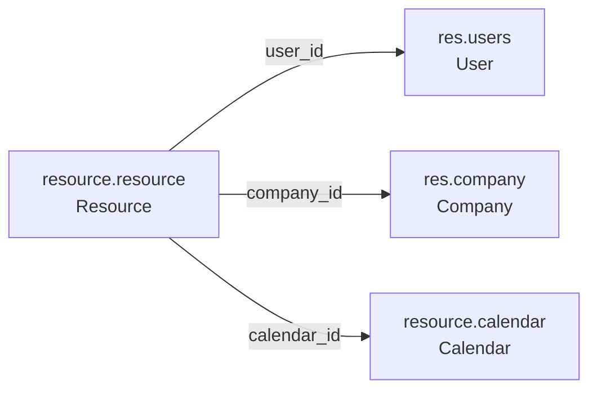
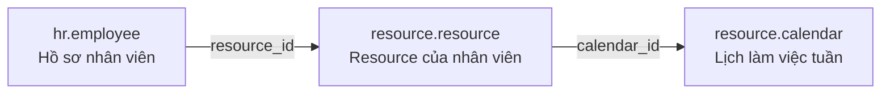

# `resource.resource` trong Odoo

## 1. Tóm tắt một câu

`resource.resource` là model đại diện cho **một người hoặc một tài sản có thể được xếp lịch**. Nó cho Odoo biết đối tượng là ai/cái gì, thuộc công ty nào, dùng lịch nào và có thể làm việc vào khoảng thời gian nào.

Ví dụ resource:

- Nhân viên Nguyễn Văn A
- Máy CNC 01
- Phòng họp A

> `resource.resource` không phải bảng chấm công, timesheet, bảng lương hay hồ sơ HR đầy đủ.

## 2. Vị trí mã nguồn

- Model: `addons/resource/models/resource_resource.py`
- Khai báo model: `class ResourceResource(models.Model)` với `_name = 'resource.resource'`
- View: `addons/resource/views/resource_resource_views.xml`
- Menu/action: `addons/resource/views/menuitems.xml`
- Quyền truy cập: `addons/resource/security/ir.model.access.csv`

Trong database, tên bảng thường là:

```text
resource_resource
```

## 3. Vì sao model này tồn tại?

Nhiều module cần trả lời cùng một câu hỏi:

> Đối tượng này có rảnh và có thể được sử dụng trong khoảng thời gian X không?

HR cần kiểm tra nhân viên có làm việc không; Project cần biết người được giao task có khả dụng không; MRP cần biết máy có thể chạy không; Planning cần xếp ca. `resource.resource` cung cấp một lớp chung để các module này dùng cùng logic lịch thay vì mỗi module tự xây dựng một hệ thống riêng.

## 4. Các field quan trọng

`resource.resource` chủ yếu lưu **thông tin nhận diện và liên kết**. Nó không lưu chi tiết từng dòng giờ làm; phần đó nằm ở `resource.calendar` và các model liên quan.

| Field | Ý nghĩa |
|---|---|
| `name` | Tên resource; bắt buộc. Ví dụ `Nguyễn Văn A`, `Máy CNC 01`. |
| `resource_type` | Loại resource: `user` (Human) hoặc `material` (Material). |
| `user_id` | Liên kết tới `res.users`, thường dùng cho resource là con người. |
| `company_id` | Công ty sở hữu/sử dụng resource. |
| `calendar_id` | Lịch làm việc (`resource.calendar`) mà resource sử dụng. Đây là field cốt lõi. |
| `tz` | Múi giờ của resource; bắt buộc, mặc định lấy từ context/user hoặc `UTC`. |
| `active` | Ẩn resource khi không còn sử dụng mà không xóa record. |
| `time_efficiency` | Hệ số hiệu suất; dùng để tính thời lượng dự kiến, đặc biệt trong MRP. Phải lớn hơn 0. |
| `avatar_128`, `share`, `email`, `phone` | Thông tin hiển thị/liên quan tới user; một số field là computed hoặc related. |

### Bốn field cần nhớ đầu tiên

Nếu mới đọc model, tập trung trước vào:

```python
name
resource_type
user_id
calendar_id
```

- `name`: resource là ai/cái gì, ví dụ `Nguyễn Văn A`, `Máy CNC 01`.
- `resource_type`: `user` là người, `material` là máy móc/tài sản.
- `user_id`: liên kết resource với user Odoo; thường dùng khi resource đại diện cho nhân viên.
- `calendar_id`: resource dùng lịch làm việc nào; đây là field quan trọng nhất về mặt lịch.

### Các field hỗ trợ tính lịch và trạng thái

```text
company_id       → resource thuộc công ty nào; cũng được dùng để chọn calendar mặc định
tz               → tính thời gian theo múi giờ nào
active           → còn sử dụng hay đã được ẩn
time_efficiency  → hiệu suất của resource, thường dùng trong sản xuất
```

`time_efficiency` không phải số giờ làm. Ví dụ `100` là hiệu suất chuẩn, `200` là nhanh gấp đôi và `50` là chậm bằng một nửa.

### Những gì không nằm trực tiếp trong `resource.resource`

Các câu hỏi sau được trả lời bởi các model lịch khác:

```text
Thứ mấy làm việc?              → resource.calendar.attendance
Mấy giờ bắt đầu/kết thúc?      → resource.calendar.attendance
Ngày nào nghỉ/bị bận?          → resource.calendar.leaves
```

Vì vậy có thể đọc các field theo công thức:

```text
name + resource_type → Resource là ai/cái gì?
user_id              → Liên kết với user nào?
company_id           → Thuộc công ty nào?
calendar_id          → Dùng lịch nào?
tz                   → Tính giờ theo múi giờ nào?
active               → Còn sử dụng không?
time_efficiency      → Hiệu suất bao nhiêu?
```

## 5. Quan hệ trực tiếp của model



Sơ đồ này chỉ thể hiện các quan hệ trực tiếp được khai báo ngay trên `resource.resource`. Chi tiết bên trong `resource.calendar` thuộc tài liệu riêng của model `resource.calendar`.

### Trường hợp HRM

Trong HRM, một nhân viên thường có một resource tương ứng. `hr.employee` giữ hồ sơ nhân sự; `resource.resource` giữ phần thông tin phục vụ lập lịch; còn `resource.calendar` định nghĩa lịch làm việc hàng tuần.



Ví dụ:

```text
Nguyễn Văn A
    → Resource của Nguyễn Văn A
        → Lịch hành chính
            → Thứ 2–Thứ 6, 08:00–12:00 và 13:00–17:00
```

Khi tạo nhân viên, Odoo thường tạo hoặc liên kết resource tương ứng. Khi muốn thay đổi lịch làm việc của nhân viên, phần lịch tuần được cấu hình ở `resource.calendar`; `resource.resource` chỉ trỏ tới lịch đó qua `calendar_id`.

Có thể hiểu:

- `resource.resource`: **Ai/cái gì được xếp lịch?**
- `resource.calendar`: **Thường hoạt động lúc nào?**
- `resource.calendar.attendance`: **Chi tiết các dòng giờ làm trong tuần**
- `resource.calendar.leaves`: **Khi nào nghỉ, bị bận hoặc không sử dụng được?**

## 6. Luồng ví dụ

Một nhân viên có record:

```text
Resource: Nguyễn Văn A
Type: Human
User: nam@example.com
Company: Công ty ABC
Calendar: Lịch hành chính
Timezone: Asia/Ho_Chi_Minh
```

Lịch hành chính quy định:

```text
Thứ 2–Thứ 6: 08:00–12:00 và 13:00–17:00
```

Nếu nhân viên nghỉ ngày 15/09/2026, Odoo có thể suy ra:

```text
09/09/2026: làm được 08:00–12:00, 13:00–17:00
09/09/2026: không làm được 12:00–13:00
15/09/2026: không khả dụng cả ngày do nghỉ
```

Các module HR, Project, Planning hoặc MRP dùng kết quả này để phân công, lập kế hoạch và tính deadline.

## 7. Các method nên đọc trước

### `create()`

Khi tạo resource, Odoo tự bổ sung một số giá trị:

- Nếu có `company_id` nhưng chưa có `calendar_id`, lấy lịch mặc định của công ty.
- Nếu chưa có `tz`, cố gắng lấy timezone từ user hoặc calendar.

### `default_get()`

Chuẩn bị giá trị mặc định khi mở form tạo resource, đặc biệt là calendar theo company.

### `_adjust_to_calendar(start, end, compute_leaves=True)`

Điều chỉnh thời điểm bắt đầu/kết thúc về các giờ làm việc hợp lệ gần nhất theo calendar. Method này có xét múi giờ và có thể xét ngày nghỉ.

### `_get_valid_work_intervals(start, end, calendars=None, compute_leaves=True)`

Trả về các khoảng thời gian resource thực sự có thể làm việc trong khoảng `start`–`end`.

Nếu resource không có calendar, nó được xem là **fully flexible** và toàn bộ khoảng truyền vào được coi là khả dụng.

### `_get_unavailable_intervals(start, end)`

Tính các khoảng resource không khả dụng. Code ghi chú method này được Enterprise dùng cho Forecast/Planning.

### `_is_fully_flexible()` và `_is_flexible()`

Kiểm tra resource có lịch cố định hay làm việc linh hoạt.

## 8. Phân biệt với các khái niệm dễ nhầm

| Khái niệm | Câu hỏi trả lời |
|---|---|
| `resource.resource` | Đối tượng nào có thể được xếp lịch? |
| `resource.calendar` | Đối tượng đó thường làm việc lúc nào? |
| `resource.calendar.leaves` | Khi nào đối tượng nghỉ/bị bận? |
| `hr.attendance` | Nhân viên check-in/check-out thực tế lúc nào? |
| Timesheet (`account.analytic.line`) | Đã dùng bao nhiêu giờ cho project/task nào? |
| `hr.employee` | Hồ sơ HR đầy đủ của nhân viên là gì? |

## 9. Cách học model này

Đọc theo thứ tự:

1. `_name` và `_description` để biết model đại diện cho gì.
2. Các field, đặc biệt `resource_type`, `user_id`, `company_id`, `calendar_id`, `tz`.
3. `default_get()` và `create()` để hiểu giá trị mặc định.
4. `_adjust_to_calendar()` và `_get_valid_work_intervals()` để hiểu cách tính thời gian.
5. Sau đó mới xem các module kế thừa như `hr`, `hr_holidays`, `resource_mail`.

## 10. Kết luận

`resource.resource` là **hồ sơ chung của mọi đối tượng cần quản lý thời gian sử dụng**. Bản thân record không lưu toàn bộ lịch chi tiết; nó liên kết tới calendar và được các method trong model dùng để tính lúc nào resource làm được, nghỉ hoặc không khả dụng.
